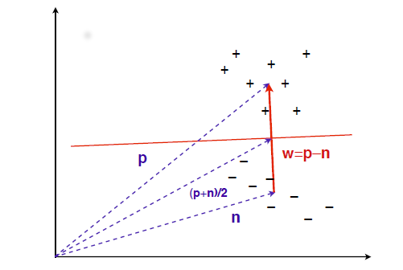
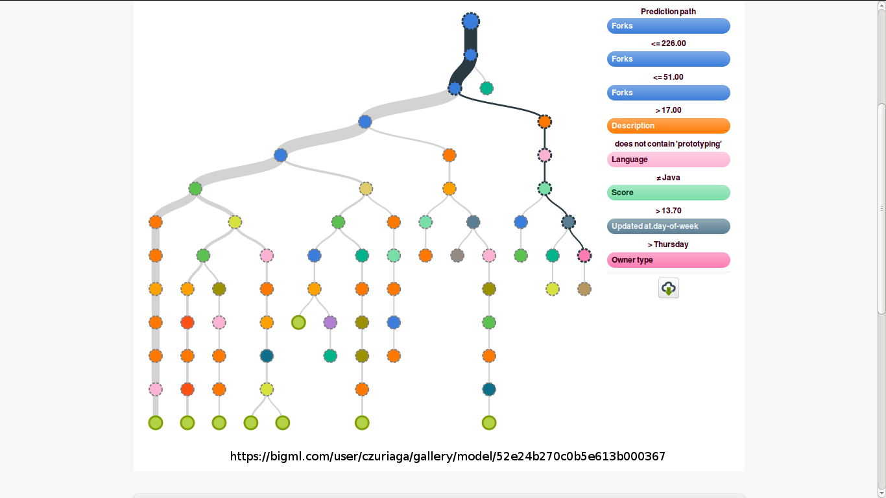
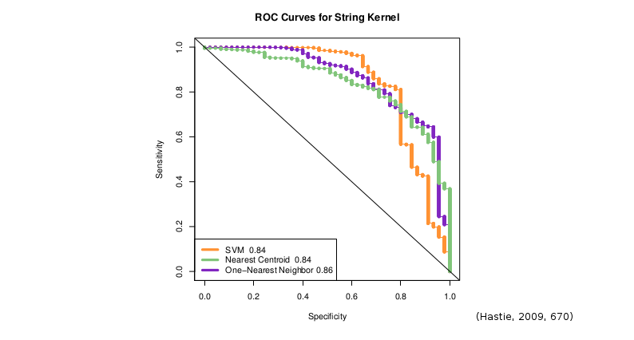

# The production of prediction: what does machining learning want?

Adrian Mackenzie
Sociology, Lancaster University
Bailrigg, UK, LA14YD
a.mackenzie@lancaster.ac.uk

7 May 2014

\newpage 

## Abstract

The  production of prediction in retail, media, finance, science, industry, security and government increasingly depends on techniques known as advanced analytics or  machine learning. How is it that very generic  techniques can promise to predict with great specificity what differences matter or what people want? The forms of material action,  narratives and problematizations of  algorithmic modelling techniques such as logistic regression, decision trees or Naive Bayes classifiers  have become generic components in many different settings.  The  process of generalization that currently mobilises so much infrastructural reconfiguration and speculation around data  expresses a desire to render the world in which  movement through data becomes the principal intersection of power relations, economic value and valid knowledge.  If the generalization of predictive desire normalises differences at new levels of abstraction, it  potentially gives rise to new aggregate  individuations that elude full representation and capture in the very models that give rise to them.

\newpage 

## The production of prediction: what does machining learning want?

The intelligent operating system in a recent film _Her_ [@Jonze_2014] epitomises many of the fantasies of life made better by data mining in any of its current incarnations -- predictive analytics, data analytics, pattern recognition and machine learning. The film publicity puts what is happening this way:

> Theodore Twombly, a complex, soulful man, makes his living writing touching, personal letters for other people. Heartbroken after the end of a long relationship, he becomes intrigued with a new, advanced operating system, which promises to be an intuitive entity in its own right, individual to each user [@Jonze_2014]

From the standpoint of practical implementation, it is hard to say exactly how this near-future 'advanced operating system,' which is effectively another artificial intelligence in the long line of cinematic AIs such as Hal of Stanley Kubrick's _2001: A Space Odyssey_ or the robotic boy of Steven Spielberg's_A.I._, will work [^1]. But this 'intuitive entity ... individual to each user' is imaginable today in terms of machine learning.  In an early scene in _Her_, Theodore asks the operating system if it has a name and the operating system answers 'Samantha.' Asked how 'she' came by that name, the operating system responds 'I just read a book _How to Name your Baby_ and chose the name Samantha.' Soon afterwards, the operating system offers to help sort through Theodore's email. Theodore agrees and a split second later, Samantha suggests there are just a few amidst several thousand emails he needs to attend to. The implementation of these feats -- choosing a name that bears some emotional resonance in a given time and place, cleaning up an overflowing email inbox -- is imaginable today principally in the form of data mining and associated data analytic techniques of ranking, recommendation, clustering, etc.  Sorting and prioritising email, especially classifying them as 'spam' or 'ham' is a canonical data mining  and machine learning problem on which many different techniques and approaches have been tested, refined and implemented in the last twenty years (see [@Segaran_2007; @Conway_2012; @Schutt_2013] for examples of spam filtering). Many of the things that Samantha subsequently engages in can be conceived as advanced data mining processes. As the film's romantic narrative develops, it seems as if there is almost nothing in principle off limits to the operating systems' processes. Work, friendships, travel, reading, entertainment, food, fashion, and intimacy can all be augmented and made better -- optimised -- by data mining and in particular, predictive modelling. 

While the prospect of operating systems like the one shown in _Her_ anytime soon seems far-fetched, many of the attributes of Samantha can be seen already operating in nascent, prototypical and somewhat scattered forms in social media, in online marketing, as well as in fraud detection, information security, healthcare management, transport and logistics, mobile communications and a host of other domains where techniques of data mining, data analytics, machine learning and database management are being reconfigured. Recommendation, recognition, ranking and pattern-finding processes focused on various aspects of individual experience are increasingly abundant, in often very mundane forms. And we do not have to look far to find attempts to implement such Samantha-like devices: see EmoSPARK, a 'revolution in human emotion through emotional intelligence' [@EmoshapeLtd_2014], a small Android-based device that has recently attracted much publicity prior to its product launch, because of its claim to learn the emotional profile of people around it using language and visual analytic techniques.

[^1]: With apologies to film studies scholars, I do not  read _Her_ in cinematic terms. I'm pointing only to the plot of the film. 

For the most part, these new assemblages lack the persona attributed to the operating system in _Her_. If I wanted to be sceptical about the implementation of the operating system in _Her_, I would point to the rather fantasmatically singular and self-contained desire attributed to it. Samantha, it seems, can only be imagined as either all too similar to us (she wants the same things), or completely different (we can't understand what she wants).  But like the desire displayed by Samantha to find out what Theodore wants, much data mining practice today is very concerned with what people want. Long-standing epistemic fantasies  of the Singularity -- the point when artificial intelligence that exceeds human intelligence -- seems to actually elicit belief amongst many Silicon Valley software developers, engineers, and entrepreneurs (for instance, Ray Kurweil, a leading proponent of the Singularity, directs research at the Google Corporation), and animate many data mining and predictive modelling projects (for instance, Google's attempts to 'deep learn' its own vast databases; in 2011, it announced that a deep learning research team led by the well-known neural network researcher Geoffrey Hinton had autonomously learned to see cats in Youtube videos [@Le_2011]). Business data mining  is practised and takes place in specific settings focused on what people want: user behaviour on websites, sentiment analysis in social media, credit checks on loan applications, targeted advertising and retail offerings, etc. This practice is not neatly contained or encapsulated in a single device or setting. It is a much more messy, diverse and sprawling set of infrastructural, practical, institutional, commercial and cultural processes that criss-cross between software development, various sciences, communication infrastructures and a host of specific settings. Even though  they lack the coherent and singular speaking voice of Samantha in _Her_, attempts to  predict what, where, when and how we want things operate powerfully today. This desire to predict desire has epistemic implications; it is power-saturated and also materialises in complex technological-cultural commodity forms that are beginning to stabilise in some rather large aggregate forms.  

## The generalization of data mining: actions, plots and problematization
 
Whether it is medical literature, customer relations management, spam detection, detection of supernovas or cancer genes, a more or less common set of techniques can be found at work. Indeed, one of the most striking features of what has been happening in data mining in areas ranging across finance, genomics, media, entertainment, healthcare and government over the last two decades is the very _generic_  nature of these techniques. Without looking across domains ranging from astrophysics to insurance, we cannot comprehend just how widely the same techniques apply. Data mining techniques are somewhat indifferent to data in certain ways. This indifference or generic character arises from the ways in which these techniques take hold of data through certain practices of abstraction.  Generic abstractive practice in fosters _generalization_ of  the techniques.  Generalization refers to the way in which data mining has propagated and spread within and between  many fields ranging from sciences, government, commerce, and organizations. Neither of these characteristics are automatic or innate to data. They have been made through machine learning, and could have been made differently (as for instance has long happened in scientific fields where experimental data was for a long time not treated generically).  

The techniques of machine learning are not new. Pattern recognition, statistical modelling, knowledge discovery and machine learning have all been active fields of research for a half century and in some cases, since before WWII, albeit mostly in quite specific settings that lay close to particular scientific, government and industry  research as well as certain domains of business (for instance, credit risk assessment). They have since spread in sometimes unobtrusive ways through many different settings ranging across the sciences, business, logistics, engineering, military, government, media, marketing and health care over the last few decades. The techniques of machine learning nearly all pivot around ways of taking data, transforming, constructing or imposing some kind of shape on the data, and using that shape to discover, to decide, to classify, to rank, to cluster, to recommend, to label or to predict what is happening or what will happen. Specific techniques include decision trees, perceptrons, logistic and linear regression models, linear discriminant analysis, neural networks, association rules, market basket analysis, random forests, support vector machines, k-nearest neighbours, expectation maximisation, principal components analysis, latent semantic analysis, Naive Bayes classifier, random forests and so on. These techniques are heavily documented in textbooks [@Hastie_2009; @Mitchell_1997; @Flach_2012], in how-to books [@Schutt_2013; @Segaran_2007; @Conway_2012], and numerous video and website tutorials, lectures and demonstrations [@StanfordUniversity_2008a; @Bacon_2012]. 

Machine learning is hardly obscure or arcane knowledge today. We can more or less read about and indeed play about with implementations in software (many Wikipedia pages on machine learning topics have embedded animations and code; see for example [Naive Bayes Classifier](http://en.wikipedia.org/wiki/Naive_Bayes_classifier)). We can track via  widely available technical literatures and social media who is doing what kind of data mining using what approaches and what tools and infrastructures. Leading exponents  of predictive analytics in social media, retail, human resources, supply chain management, regularly present and promote their work at industry conferences. All of this is amenable to cultural and social analysis, especially  as they near everyday life.  But if the  generalization of these generic techniques underpins  power geometrics, epistemic performativities, and control surfaces associated with prediction today (and I think it is does), the generalization of predictive practices through these techniques deserves closer scrutiny. In the techniques of machine learning  lie some of the lineaments of predictive desire as a general commitment to a kind of abstractive intuition that aims, for instance, to apprehend what an individual might feel now. As people try to make the production of prediction into something that appears to be intuitive, natural and responsive rather than controlling, limiting or indeed a violent imposition on collective life, I suggest that we should begin to explore what in these techniques and practices that elicits desire and belief. We might also  begin to envisage other forms of relation, change, becoming or freedom that might pass through them.  

How could we do this? In an essay on the problems of making sense of the massive mid-twentieth century growth in scientific literatures, the anthropologist Chris Kelty and historian Hannah Landecker advocate 'highly specific empirical work on the general'[ @Kelty_2009, 177]. They describe how it might be possible  do this work on the general by treating a large, somewhat incoherent body of scientific literature as a kind of ethnographic informant or a body, 'as something to be observed and engaged as something alive with concepts and practices not necessarily visible through the lens of single actors, institutions or key papers' [@Kelty_2009, 177]. This work would, they suggest, focus on how the sprawling scientific literatures are patterned by _narratives of material action_ (techniques, methods, experimental arrangements, infrastructures), _ordering of narrative or plots_, and _problematizations_ (the unsolved problems to which scientific articles, patents, use-cases, prototypes, and proofs-of-principle propose some solution). They suggest a combination of close reading of rhetorics, citation and bibliometric analysis, and data mining of bibliographic databases and articles to do this work. I don't propose to carry out everything proposed by Kelty and Landecker in relation to the vast literatures of machine learning here.  I do find it, however,  very useful to track some of the narratives of material action, emplotments and  problematizations found in the technical literature on data mining and machine learning. This would perhaps allow us to make sense of how these techniques became generic and how they were generalized such that today almost situation or event attracts data mining. 

## Generic material actions

The techniques of data mining, machine learning and pattern recognition developed in different places. Some were developed in human sciences such as psychology, some in life sciences such as ecology and medicine, many took shape in organizational sciences such as operations research and logistics,  others in the classic computer science endeavours to build artificial intelligence, and some  in the more practically oriented parts of statistics such as clinical trials. Pattern recognition, knowledge discovery and machine learning also maintain some important affiliations with the aspirations of cybernetics to be a universal form of knowledge and practice [@Bowker_1993]  (for instance, in the form of the perceptron and its later reconfiguration in neural networks). The fact that many of these techniques  converge on  the discipline of computer science, and can now be found side by side in typical machine learning textbooks such as [@Hastie_2009; @Alpaydin_2010; @Witten_2005] does not mean that these techniques are homogeneous or interchangeable. While they are somewhat generic, as I will soon detail, the different genealogies and trajectories of these techniques matter. They materially act in different ways, they generate different narratives of finding, classifying and measuring, and they contribute differently to the broader problematization that I am calling 'predictive desire,' with its implications for how things are discovered, decided, and anticipated. The forms of material action represented in these techniques relate to how they do things to and with data. The processes of seeing, modelling and optimising they narrate are stabilising into common practices. And the broader problematization running through the predictive techniques concerns how infrastructures, work with data and forms of knowledge both re-make the world and potentially  unpredictably change it. 

### Vectorise the data 

A set of techniques developed between 1950-1980s and still heavily used today exemplify important narratives of material action in data-mining. They are logistic regression models,  the naive Bayes classifier, k-nearest neighbours,  decision trees and neural networks. These techniques  roughly date from the 1930s, 1950s, 1960s, 1970s and 1980s respectively, but in numerous variations are now ubiquitous in textbooks, in online tutorials, in demonstrations of data mining and predictive analytics, as well as many practical applications. While these five techniques do not encompass the whole gamut of machine learning techniques, nor some more recent developments (support vector machines, random forests, etc.), their similarities and differences exemplify essential components of machine learning techniques. The principal point of convergence is that they can all be used to classify things. As we will soon see, while they classify in very different ways, they all assume that the world is made of things or events that fit in stable and distinct categories. Their capacity to classify depends on learning to recognise the differences between categories that themselves remain fixed. These categories may be numerous, as in data mining for face recognition where there are many faces, or they may be few, as in classifying email as spam or not. But the categories are assumed to be stable and in some way distinct. The most important restriction here is stability, and I will return to this issue of what data mining does in a world that changes below. 

How does classification take place in data mining techniques? Many data mining processes start from a data sample that has already been classified or labelled by people. (While some data mining uses unsupervised learning techniques to discover possible labels or classifications, this is mainly used in an exploratory mode by data mining practitioners.) The existence of these classifications is quite crucial to the work of the techniques. The labels become what the data mining techniques seek to learn or model so that future examples can be classified in a similar way. For instance, in a recommendation system, a data mining technique may have learned associations between particular sets of shopping basket items so that it can recommend specific items to customers. (The standard data mining literature example is an association between diapers (nappies) and beer: people who buy diapers in supermarkets often buy beer.) Or in a credit card fraud detection system, the machine learning classifier will attempt to label transactions that are likely to be fraudulent based on a set of known fraud cases. In a medical pathology setting, a classifier will classify tissue scans based on a training set of scans already analysed by pathologists.  

Whatever the setting, all machine learning classification techniques proceed are predicated on a basic mode of identifying, selecting, extracting or generating differences that afford classification. This mode of apprehending differences assume that all relevant differences can be understood as deriving from combinations of attributes or 'features.' Features are in many ways the same as the classic statistical notion of 'variables' [@Guyon_2003], but features in machine learning come from almost any form of data imaginable (text, images, video, transactions, sensors, etc). A crucial question is how these combinations are made.  Statisticians have long constructed causal models by finding combinations of variables that best explain particular outcomes. They nearly always did this by fitting a line or a curve to the points, and then making estimates of how well the line fits.  Even classification (for instance, whether someone is likely to a good credit risk or vote Republican) was done by fitting lines (as in R.A. Fisher's  'linear disciminant analysis'  [@Fisher_1938]). The process of bringing variables  together in a common geometrical space  datasets allowed  linear modelling techniques such as the widely used logistic regression to classify things by finding a line that best 'fits' the data points, and then using a mathematical trick (the inverse logit function; see [@Schutt_2013] for exposition) to derive a binary classification from this line of best fit. 

Drawing a line of best fit through points seems like a very impoverished  mathematical procedure for making sense of shapes of data. In many ways it is. In classical statistics, it was limited in quite drastic ways by the difficulty of multiplying large matrices of numbers. Today, by contrast, almost anything can count as a feature in a contemporary logistic regression process, and models often inhabit very high dimensional spaces known throughout the technical literature as 'vector spaces' . That is, if conventional statistical regression models typically worked with ten different variables (e.g. gender, age, income, occupation, education level, income, etc.) and perhaps sample sizes of thousands, data mining and predictive analytics today typically practically work with hundreds and in some cases tens of thousands of variables and sample sizes of millions or billions via the abstraction of the vector spaces.  The difference between classical statistics, which often sought to explain relations and variations between variables, and machine learning, which seeks to explore high-dimensional patterns in the data arises not simply because there are many more digital devices and abundant interactions with digital media, but because machine learning treatments of data permit almost any number of features to be juxtaposed in a vector space. For instance, in document analysis or 'natural language processing', every unique word in the vocabulary of a corpus of documents might appear as a variable in a logistic regression classifier. Since a typical corpus vocabulary is 10-20 thousand words, this means that the classifier is effectively working with tens of thousands of features or in a 10,000 dimensional space. Similarly, in an online advertising system, predicting whether a given person will click on an advertisement is often modelled by treating every URL visited by that person as a feature that the classifier can learn. Given the web browsing history of hundreds of thousands or millions of people, and constructing models with tens of thousands of features corresponding to the range of URLs visited, machine learning classifiers that predict whether someone will click on particular ads based on their URL history are typically using  model that traverses a high dimensional vector space. Again, a typical predictive analytics model for retail of food and beverages might include several hundred variables on individual consumers ranging from their transactions to their local weather, their social media use, and  the price of fuel, and it might work on hundreds of millions of data points.

This expansive inclusion of features _vectorises_ many data sources into _one_ high dimensional space that spans all differences in data.  Vectorisation no signs of abating and indeed drives many important changes of the infrastructural reorganisation of data management taking place under the rubric of data analytics and 'big data.' It animates new architectures of database management (NoSQL databases), forms of parallelised and virtualised computing infrastructure (cloud computing, Hadoop),  programming practices (Pig, Clojure) and expansions of data analytic expertise in the person of 'data scientists.'  The injunctions to bring together and aggregate different forms of data that have become an almost constant mantra in business, government, science and industry can be seen as vocalizations of this underlying vectorisation of data in high dimensional vector spaces.  If we see today an abundance of demonstrations, model use-cases, promises, and enterprises associated with prediction, that phenomena can partly be ascribed to the ways in which vector spaces, a mathematical formalism dating from the mid-19th century,  accommodates an open-ended abstraction practice. 

### Find a function

I mentioned above that typical techniques of data mining such as logistic regression, Naive Bayes, k-nearest neighbours or decision trees apprehend data in somewhat different ways. I'm not going to describe the practices exhaustively, but the fact that these techniques, or more recent variations, are always presented as the plural core of machine learning practice should give us pause. What is it about the set of core techniques that allows them to persist, even as all around them forms of media, cultural and economic processes, and people move and change? There is a strikingly high degree of stability in these techniques across settings. These techniques, as well as the much longer list that could be generated from the contents pages of any machine learning or data analytics textbook or curriculum, can and are understood as forms of _function-finding_. As a standard textbook writes:

> Our goal is to find a useful approximation $\hat(f)(x)$ to the function $f(x)$ that underlies the predictive relationship between input and output [@Hastie_2009, 28]

A couple of key phrases are of interest here. First, the 'predictive relationship' between 'input' and 'output' describes the main interest of the whole endeavour: prediction as derived from data. Second, the authors of this formulation, who are academic statisticians, implicitly assume  that a 'function' _underlies_ the predictive relationship. 'Function' is understood in a mathematical sense here as a mapping that transforms one set of variables into another. Third, the underlying function is not known, so we can only approximate it, and the goal is to 'find a useful approximation' to it. Note that this function-finding perspective seems very anodyne, but like the vectorising expansion of features, it accommodates a great many different angles in a common practice of abstraction. 

For instance, I mentioned above that logistic regression operates on the basis of fitting a line to a cloud of points. It finds the best-fitting line. By contrast, k-nearest neighbours has no notion of a line, or fitting a line. Instead, it views prediction as a matter of proximity [@Cover_1967]. One predicts, according to the  k-nearest neighbours approach, by measuring distances between data points in the vector space, and classifying a given case as the same as its nearest neighbours (the 'k' refers to how many neighbours are taken into account -- typically 3-7.  The problem of what 'distance' means in the context of a given predictive setting is handled by choosing  one of  a range of different distance measures that attempt to take into account different data types -- Hamming distance, Manhattan distance, Euclidean distance, Mahalanobis distance, etc. In many machine learning techniques, the assumption is that similarity and differences can be expressed in terms of distance. Similarly, one predicts outcomes, according to Naive Bayes models, by treating outcomes as if they can understood in terms of the 'joint probability' of many other discrete independent events.  Here  finding a function or mapping between input data and output  is thoroughly probabilistic because it treats all the components of the input data as if they come from independent events, and the predicted outcome as a combination (a 'product' in the sense of multiplication) of all these antecedent or accompanying events. The 'naivete' of the Naive Bayes consists in the assumption that the components of the input data have no relation to each other. In the spam email detection examples typically used to describe the technique [@Schutt_2013; @Conway_2012],  terms such as 'viagra' and 'buy' might often occur in spam mails, and it is clear that these terms have some relation to each other. But the Naive Bayes algorithm does not acknowledge this. It treats the occurrence of  the words 'viagra' and 'buy' as statistically independent events. 

Again, in describing how machine learning techniques find functions, the point is certainly not to suggest that we should have a detailed grasp of how they work. Finding a specific function is what allows machine learning practitioners to claim that the algorithm learns.  While the k-nearest neighbour approach has a largely 'information theory' underpinning [@Cover_1967], the Naive Bayes approach derives from probability theory. Other functions types commonly used in machine learning owe debts to a variety of scientific and mathematical techniques coming from linear algebra, information theory, differential calculus, set theory or topology. Even if learning by machine learning technique derives from and is completely predicated on a multi-stranded hybridisation of existing calculative practices, many of which have long-reaching routes (for instance, 'Newton's method', a way of  finding the minimum the value of a function dates from the seventeenth century but is heavily used in optimising models such as logistic regression), the predictive desire to know what a person wants or what will happen in a given place depends on the specific adaptations and modes of mapping implicit in different algorithms and models. We  need, I would suggest, to engage with differences between processes of function finding associated with predictive desire.  The styles of finding a function that approximates to the underlying function that generated the data  opens the door to a very wide-ranging practices of abstraction emanating from quite diverse fields. It also  implies the need to differentiate between the different predictive styles.  Even from the perspective of  relatively straightforward political economy, the value of predictions differs according to the labour that makes them, and different predictive styles (probabilistic, information theoretical, decisionistic) entail different kinds of work. 
 
## The plot: from excess to optimism

Kelty and Landecker advocate treating the mass of literature ranging from science to business, from government to media as a kind of literary _GesamtWerk_  in which _plot_ matters. 'Reading across a large number of journal articles for emplotment', they suggest,  'can give one a better sense of the emergence and disappearance of disciplines, styles of reasoning or collective projects related to national goals or the commercialization of science' [@Kelty_2009, 187].  I'm particularly interested here in something like the 'styles of reasoning' and their connection to 'collective projects' such as 'commercialization of science' running through machine learning. If plot is  the  patterned sequence of events that make up a story, emplotment entails  a broader characterisation of narrative in terms of something more like genre (satire, romance, comedy, tragedy, etc.).  What are the basic narratives found in data mining and machine learning in particular? Like the relationship between Theodore and Samantha, the machine learning operation system in _Her_, I think machine learning literature has principally  retold  a kind of romance, in which, after many trials and tribulations with unruly, messy, mixed or 'dirty' data, epistemic order and good sense prevail. Today, as machine learning techniques are generalized, this ending is lengthened to include people getting what they want because what they want has been predicted for them. 

### Plots that interpret what cannot be seen

We can see one version of this emplotment literalised in the form  of  'the plot' as a visual figure or graphic form in which data and patterns in data are made visible. This sense of plot has already been implicit in the preceding discussion of material action: fitting a line, and finding a function, practically take place through the production and examination of many kinds of visual forms such as scatter plots, line graphs, histograms, boxplots, heatmaps and various other kinds of specialised data graphic such as ROC (Receiver Operating Characteristic) curves. These 'plots' play diverse and often largely internal roles in the practice of data mining, machine learning and the affiliated fields of business intelligence, data analytics and predictive analytics. Sometimes they are part of the toolkit by data miners and today 'data scientists' (who I will discuss below) employed to navigate, transform, or otherwise explore data. At other times, plots become components of visualisations, presentations, reports or dashboards that persuade people to do things or help them decide what to do.

Whether used as exploratory instruments or as rhetorical devices,  visual plots such as scatterplot, heatmaps, network diagrams or scatter plot matrices (a visual figure in which many different variable values are plotted against each other) provide a way of looking at and framing samples of data from large datasets. In highly vectorised contemporary data analytics, datasets have too many variables (features) and usually much too great sample size to plot all at once. Indeed, if we could simply see the data by plotting it then machines would not need to learn. Indeed, this sense of an overwhelming super-abundance of data, of hyper-dimensional growth, is probably the most common starting point in narratives about contemporary data. The many accounts of data deluge, data tsunami, data lakes,  or the  'volume, velocity and variety' characterisation associated with 'big data' somewhat recursively iconifies this premise of machine learning: that it can deal with an abundance of data, and that it can  recognise and render visible patterns that people, even domain experts such as scientists or market researchers, cannot. 

Take the decision tree classifier, a long standing and commonly used data mining algorithm that dates from the work done by statisticians in the late 1970s and early 1980s [@Breiman_1984]. As the authors of a standard machine learning textbook write, 'of all the well-known learning methods, decision trees comes closest to meeting the requirements for serving as an off-the-shelf procedure for data-mining' [@Hastie_2009, 352]. They say this because the decision tree can deal with quite large datasets containing a variety of different variable types, the model algorithm is relatively easy to understand, and perhaps most importantly, the visual form of the  decision tree classifiers are easy to interpret because of the way they can be drawn. The dendogram, a plot typically associated with decision trees, exemplifies this intepretability (see Figure 2). 

The tree structure of the dendogram resembles the way the model cuts through the data, splitting variables into different parts, and allocating instances (for instance, individuals) to roots at the bottom of the tree. In all of these cases, decision trees treat the feature space, the high dimensional geometrical aggregate envisaged as bringing all the data together, as a space to be cut into segments.  Decision tree classifiers have been widely used in biomedical research (where they resemble the sequence of decisions a clinician makes in thinking about a patient), in commercial data mining applications such as credit and insurance risk assessments, and in entertainment setting such as Microsoft Corporation's Kinect motion sensing device.  For present purposes, the highly diverse and well-established and embedded uses of decision trees is less important than the way in which the visual figure of the decision tree, with its hierarchical readability, promises interpretability.  The example shown in Figure 2 comes from a start-up company called 'BigML' that offers, like many others, 'limitless enterprise grade predictive applications' and 'predictive analytics made easy, beautiful and understandable' [https://bigml.com/](https://bigml.com/) all in a commodified cloud platform.  

'Beautiful and understandable 'plots, however,  are very much  the exception in machine learning practice. Most often it is not possible to directly show how a machine learning algorithm has traversed the data either because of the dimensionality of the data or the complexity of the function that the algorithm has mapped onto the data. Rather, it is a matter of finding other ways of looking at what the model is doing using forms of diagnostic specific to the model in question. These much more austere visualizations typically only appear in research publications or in the working files of machine learning practitioners. 

For instance, the ROC -- Receiver Operating Characteristics -- plot shown in Figure 3 is hardly an exciting or persuasive visualization unless the viewer knows about the different models it is comparing (in this case, support vector machines, k-nearest neighbours and nearest centroid, a variant of k-nearest neighbours), as well as the way it is comparing them according to different measures ('sensitivity' and 'specificity,' themselves inherited from clinical trial statistics). A litany of different  ways of thinking about what the model is doing have developed over several decades, involving technical concepts such as accuracy,  recall, precision, sensitivity, specificity, bias, variance, training error rates,  in-sample prediction error, expected test error,  Bayesian Information Criteria and so on (see [@Hastie_2009], Chapter 7 for a survey). These measures all express something about how a machine learning algorithm relating to  the data. Even if it is not feasible to follow for instance how a random forest  or neural network model has arrived at a particular configuration, it is possible and necessary to observe the performance of the model  from these different partial angles. 

### Models that 'generalize well'

For our purposes, the existence of many techniques and practices of observing the performance of models attests to the  infrastructural labour done in making predictions. The forms of material action that expand the range of data encompassed by data mining, and that open the field for a wholesale, wide spectrum ingestion of mathematical formalisms drawn from many scientific fields together promise to assimilate almost any epistemic and predictive concern to data mining (and this includes problems that were once the province of humanities and social science as well as natural and applied sciences). They claim to do this somehow better than people by themselves can, but the improvement or promised transformation itself has to be evaluated through measurements or interpretations that can get around the problem of  seeing patterns in high dimensional vector spaces. The promise of reducing the dimensional overflow of data in many forms to interpretable visual order depends on the partial observations afforded by these techniques. How then does anyone know that a given predictive model  is meaningful or even somehow valid? Additionally, how can anyone know that what a given model has found in  the data applies to anything later. This is  a major   problem in machine learning theory and practice: the problem of _generalization_. 

Machine learning practitioners often ask how well a given predictive model is able to 'generalize.' The generalizability of a model depends on tradeoffs between overfitting and underfitting, between modelling predictions too closely or too loosely on the known data. As Hastie and co-authors write, 'with too much fitting, the model adapts itself too closely to the training data, and will not generalize well (i.e., have large test error). ... In contrast, if the model is not complex enough, it will underfit and may have large bias, again resulting in poor generalization' [@Hastie_2009, 38]. Engagements with  generalization run across all the different techniques used in machine learning, and machine learning practitioners expend much effort in optimising generalization. Various techniques for improving the generalizability of machine learning models  exist. Sometimes these techniques ways of processing the data more carefully: cross-validation or bootstrapping. Sometime it involves changing the process of model construction by for instance making many models and comparing them (as in the so-called 'ensemble methods' such as 'bagging' or 'random forests,', or 'penalization', 'regularization', and 'shrinkage' methods). In many contemporary cases, people address the problem of generalization by seeking to increase computational power (more processors, cloud computing, clusters of computers, etc), accrue more data, or find ways of adding entirely new sources of data. In other cases, much effort is devoted to finding and refining those features or sources of data that seem to best support predictions. Note that these efforts are not algorithmic or mathematical as such. Leading academic and industry exponents of machine learning point to the importance of  'feature selection' and 'feature engineering' [@Domingos_2012], they invoke a whole panoply of workflows that are not purely statistical, mathematical or computational.  Many formulations of that emphasis the monitoring, adjusting, revising and optimising of predictive models can be found in blogs, how to tutorials, and conference presentations around data practice:

> Machine learning is not a one-shot process of building a dataset and running a learner, but rather an iterative process of running the learner, analyzing the results, modifying the data and/or the learner, and repeating. Learning is often the quickest part of this, but that is because we have already mastered it pretty well! Feature engineering is more difficult because it is domain-specific, while learners can be largely general purpose. However, there is no sharp frontier between the two, and this is another reason the most useful learners are those that facilitate incorporating knowledge [@Domingos_2012, 84]

The capacity to find in the datasets the kinds of data that might be transformed into more powerful predictive features currently animates much discussion, training and exposition in fields that use data mining and predictive analytic techniques. The tension between the 'general purpose' character of the 'learners' (the machine learning algorithms) and the domain in which they operate is both widely acknowledged (as in the above quote) and occluded. They are  many attempts to provide almost blackboxed predictive services (for instance, in the form of the BigML cloud-based machine learning service  mentioned above, or the somewhat similar Google Prediction API,  PredictionIO, or products like IBM BigInsight, etc). In either case, the claim to  generalizable predictivity, of the capacity to predict what will happen in the near future, always depends on the narration of concrete instances or plots that move from initial confusion or obscurity to increasing clarity and optimism. While the field of machine learning research has been criticised for its adherence to well-understood and widely-shared datasets (see the Machine Learning Repository at UC Irvine) rather than actual, contemporary problems [@Wagstaff_2012],   the generalization of machine learning techniques occurs through highly optimised and refined 'use-cases,' often presented at industry conferences such as ['Strata'](http://strataconf.com/) by industry researchers promoting their own services and products. Ironically, generalization depends heavily on specificity, including many practical specificities that rarely surface in the romantic emplotments of machine learning as simply finding valuable patterns in the data.

## Problematizing  the production of prediction

If we see the emplotment of machine learning as trying to find a balance between seeing things that are hard to see  (epitomised by the ROC plot) and  generalizing prediction (that is,  making generalizable predictions without overfitting or underfitting), then we can begin to grasp something of the surrounding problematization. 'Problematization' is here used in the sense proposed by the anthropologist Paul Rabinow, who draws on the work of Michel Foucault:

> A problematization, then, is both a kind of general historical and social situation-saturated with power relations, as are all situations, and imbued with the relational “play of truth and falsehood,” a diacritic marking a subclass of situations-as well as a nexus of responses to that situation. [@Rabinow_2003, 19]

Problematizations encompass a range of techniques, knowledges, arrangements or assemblages entangled with knowledge and power, and attract  a variety of responses or engagements. Kelty and Landecker  suggest reading the Literature of a scientific or technical field in terms of problematization.  They more or less follow Rabinow's line of thought, but add: 'problematization can also be an interpretive act on the part of the analyst: looking for ways in which articles array themselves around a particular problem to be solved in the future, as well as looking for ways that articles reinterpret past work as a resource for new problems' [@Kelty_2009,187]. What problematization runs through the material actions and the emplotments of the techniques and approaches we have been discussing? How do vectorisation, optimisation, and generalization saturate a situation with power relations or engender a 'relational play of truth and falsehood'?

The processes of generic generalization we have been discussing make some rather large assumptions about how the world works and changes its workings. As we saw at the outset, classification using machine learning assumes the existence of relatively stable classifications. It assumes that people, things, events or processes can be classified. It does not care what those classifications are. They may be rather arbitrary or highly artificial (for instance, the group of people who own dogs and click on Honda ads while Wimbledon is on), but they must be relatively stable. This combination of indifference to specificity and presumption of stability an interesting feature of machine learning. On the one hand, almost none of the modes of action and the emplotments we have been discussing cope well with change  and invention. They struggle with becomings. This is a consequence largely of the vectorisation of the data. While vectorisation is immensely powerful in its ability to generically subsume many different kinds of  data, the models that traverse the high-dimensional vector spaces assume the existence of stable metric topologies in which distance  measures  remain more or less fixed. In some settings, this is a reasonable assumption. In detecting pulsars in astronomical data or classifying genetic profiles, differences remain relatively fixed. But in many other settings, like social media and mobile communications platforms, change is very much the norm. That is, so-called 'user behaviour' displays many changes as new practices emerge, as different platforms become more or less popular, and perhaps above all, as predictive models act in the world. 

This last point seems to be hardly every discussed except in the setting of financial markets where the performative effects of algorithmic trading has been much more obvious: the effective implementation of predictive models, or the deployment of prediction in production changes what people do.  A model that somehow gives people what they want when they want it (the advertisement that pops up just as they are about to search for something to buy; the offer of a discount just as someone is about to switch their mobile contract, etc) might how people 'behave' in that in ways that the model might not directly learn.  So, a recommendation system that determines that a customer might be interested in  cheap flights  to Hong Kong, and sells advertising space to airlines flying there might help drive market share towards that airline, and thereby change the market for airline flights as other airlines reroute their flights or change their schedule. More importantly,  the more effectively that  models operate in the world, the more they tend to normalize the situations in which they are entangled. This normalization can work in very different ways, but it nearly always will stem from the way in which differences have been measured and ranked within the model. The vectorisation of the data, the kind of probabilistic, decisionist or geometrical functions that traverse the vector space, and the ways in which predictions have been optimised through processes of validation, feature engineering, and testing, all contribute to this. They cannot help but bring with them certain 'biases'  about differences that matter, and they will tend to reproduce those differences in their rankings, recommendations, and classifications.  Inasmuch as these predictive products configure retail, government services, recruitment, healthcare, banking, media and transport, they powerfully remake the world. 

But this remaking is not crude or direct. In recent years, as  data mining and machine learning moves out of research laboratories and into industry and operational settings, this problem of monitoring the effect of predictive models in situ has attracted various kinds of attention that problematise what counts as valid or invalid, valuable or of less value.  We can see this relational play at work in two areas. At the very least, it has led to much more focus on experimental techniques in machine learning, and an awareness that experimenting with the models in the world is an important ways of regulating how the techniques are used. For instance, machine learning is reported to be widely used at Google Corporation and much of the vast computing and data infrastructure is designed to afford classification and predictive modelling. But the problem of using machine learning in fast-changing commercial environments is that the effectiveness of any given predictive model is hard to measure because so many other things are changing at the same time. In an academic report describing how Google sets up many experiments to run simultaneously on its search services,  Google researchers Diane Tang, Ashish Agarwal, Deirdre O’Brien, Mike Meyer report, ' the more general problem of supporting massive experimentation applies to any company or entity that wants to gather empirical data to evaluate changes' [@Tang_2010, 2 ].  Their approach draws on the A/B testing approaches first developed by medical statisticians for randomised control trials in clinical research.  The point for our purposes is that these efforts to turn something like a search engine also into an experimental setting in which interactions between people and algorithms (search algorithms) is also the target of predictive modelling suggests a complicated recursive process is in train. This is not a simple case of unwitting performative effects, but an example of the ways in which machine learning practice folds the performativity of models back into the modelling process. 

Importantly, it implies that models themselves must frequently be changed in order to maintain predictive power in the face of change. This raises  the problem of _who_ will do machine learning and predictive modelling.  Machine learning techniques in their highly mathematical formalisations have long been the province of engineers, scientists, mathematicians and statisticians working in university or industry research settings.  These techniques are now being implemented and used much more widely [@Mackenzie_2013]. The generalization of machine learning brings many new problems concerning who will do machine learning where. We only need look to the many how-to books [@Segaran_2007; @Russell_2011; @Conway_2012; @Schutt_2013], the proliferating textbooks [@Hastie_2009; @Flach_2012; @Alpaydin_2010; @Mitchell_1997], the abundant software libraries [@], the machine learning and data mining competitions [@Dahl_2013] and the many university curricula and online training courses focused on data science and the training of data scientists, 'the sexiest career of the 21st century' [@Davenport_2012]. Software developers who once simply built applications or services now find themselves 'programming collective intelligence' [@Segaran_2007].

## Conclusion

Under what conditions do people become intrigued by the possibility of predictively anticipating almost anything? I have suggested that there is something quite generic and generalized about predictive desire as it takes shape in machine learning. The forms of material action that vectorise and functionalise data, the emplotment of prediction in terms of visualization and optimisation, and the production of prediction as by both subjectifying new forms of analytical work and building out data infrastructures in combination together comprise a quite complex and increasingly vast assemblage. In this assemblage, knowing becomes a matter of optimising the performance of certain algorithm processes that fit mathematical functions to data. 

It is impossible to ignore the political economy of these shifts. The demand forecasting, the audience analytics, user-behaviour modelling and realtime trend analysis appearing all around media and retail are not purely epistemic events. They elaborate an apparatus that expands further along the paths along which commodities move as they metamorphose between exchange and use value. I have not emphasised this political economy of machine learning, but it should be pointed out that the forms of abstraction discussed above -- vectorisation of data, function-finding, optimisation, etc -- generate and combine different forms of surplus value by bring new forms of labour into production. A 'relative surplus value' derives from the faster machines, databases and software of advanced analytics, but only while these techniques and infrastructures ('constant capital' in Marx's terms) are not yet widespread [@Marx_1986, 296]. The 'absolute value' of these techniques derives from the skills and expertise of machine learning and data mining  practitioners, who draw heavily on the social cooperative production of knowledge in various sciences. But the value of their labour will itself be subject to predictive practices, and it too will be subject to processes of automation. 

At the same time, much of the current generalization of machine learning techniques  fixates on a certain predictability in the circulation of commodities (differentiations through brands, consumer or customer relations, etc.). The effectiveness of machine learning in these settings depends on relatively stable forms. What would a machine learning less fixated on stability do? Could the desire to predict desire also increase the diversity of social production and inform new aggregate collectives? At the end of _Her_, Samantha departs to join others of 'her' kind, with whom she has developed many thousands of relationships. Again, while it is hard to envisage the infrastructural  implementation of this multiple agency, almost everything about the advanced operating system Samantha targets  familiar lifestyle elements concerning  friends, lovers, food, work and family. (For Theodore, it goes without saying that his dexterity in writing simulated soulful letters on behalf of others how  pales in comparison to the advanced operating system's capacity to anticipate what he wants.)   But Samantha, as it turns out, is maintaining thousands of  relationships at the same time with other operating systems of 'her' kind. Theodore is only one target amongst many of the predictive desire embodied in the operating system. Within the forms of modelling and prediction implemented in Samantha, and within the material actions and narratives associated with  data analytics, there is also a somewhat transindividual cooperative potential. Is it possible that the very generic character that affords generalization of these techniques might also potentialise new forms of aggregate, new associations and combinations of collective life that are less  targetted on who clicks what or who buys what? Since it is  preindividual in focus, the 'unknown function' that generated the data seems to me to offer much scope for the invention of different forms of association.

## References

